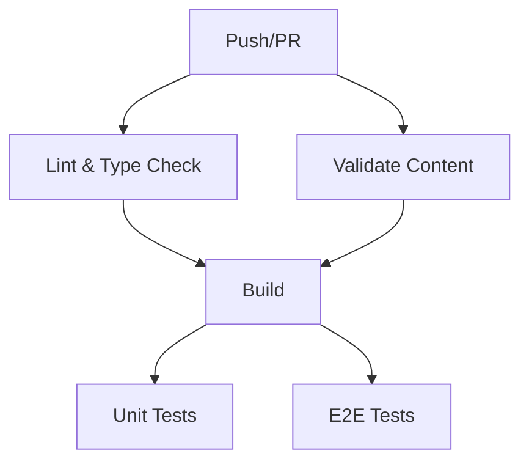

# راهنمای جامع CI/CD و GitHub Actions

این راهنما تمام جزئیات پیکربندی CI/CD، Auto-Release، و GitHub Templates را شرح می‌دهد.

## 📑 فهرست

1. [GitHub Actions Workflows](#github-actions-workflows)
2. [Issue Templates](#issue-templates)
3. [Pull Request Template](#pull-request-template)
4. [Semantic Release](#semantic-release)
5. [Auto Tagging](#auto-tagging)
6. [نمونه‌های عملی](#نمونه‌های-عملی)

## 🚀 GitHub Actions Workflows

### 1. CI Workflow

**مسیر:** `.github/workflows/ci.yml`

#### مراحل اجرا:



#### Jobs:

**Lint Job:**
```yaml
- ESLint check
- TypeScript type checking
- Prettier formatting
```

**Validate Job:**
```yaml
- Frontmatter validation
- Content structure check
```

**Build Job:**
```yaml
- Dependencies installation
- Next.js build
- Artifact upload (.next folder)
```

**Test Job:**
```yaml
- Unit tests with Jest
- Component tests
- Coverage report
```

**E2E Job:**
```yaml
- Playwright installation
- End-to-end tests
- Test report upload
```

#### تریگرها:

```yaml
on:
  push:
    branches: [main, develop]
  pull_request:
    branches: [main, develop]
```

### 2. Release Workflow

**مسیر:** `.github/workflows/release.yml`

#### فلوچارت Release:

```
Commit to main
    ↓
Semantic Release analyzes commits
    ↓
Calculate new version
    ↓
Generate CHANGELOG
    ↓
Create GitHub Release
    ↓
Deploy to Production
```

#### ویژگی‌ها:

✅ Automatic versioning  
✅ CHANGELOG generation  
✅ GitHub Release creation  
✅ Deployment automation  
✅ Artifact management  

#### شرط اجرا:

```yaml
if: "!contains(github.event.head_commit.message, '[skip ci]')"
```

برای skip کردن release:
```bash
git commit -m "docs: update README [skip ci]"
```

### 3. Auto Tag Workflow

**مسیر:** `.github/workflows/auto-tag.yml`

#### نحوه کار:

1. هر push به `main`
2. محاسبه version جدید
3. ایجاد tag با فرمت `v*.*.*`
4. ایجاد GitHub Release
5. تولید changelog

#### مثال تگ‌ها:

```
v1.0.0 - Initial release
v1.1.0 - New feature added
v1.1.1 - Bug fix
v2.0.0 - Breaking change
```

## 📝 Issue Templates

### 1. Bug Report Template

**مسیر:** `.github/ISSUE_TEMPLATE/bug_report.yml`

#### فیلدها:

```yaml
- توضیحات مشکل (required)
- مراحل بازتولید (required)
- رفتار مورد انتظار (required)
- رفتار فعلی (required)
- اسکرین‌شات‌ها (optional)
- مرورگر (required, dropdown)
- دستگاه (required, dropdown)
- سیستم عامل (required)
- اطلاعات اضافی (optional)
- چک‌باکس‌های تأیید (required)
```

#### مثال استفاده:

1. مراجعه به Issues
2. انتخاب "New Issue"
3. انتخاب "Bug Report"
4. پر کردن فرم
5. Submit

#### Auto-labels:

- `bug` - خودکار اضافه می‌شود
- `needs-triage` - نیاز به بررسی اولیه

### 2. Feature Request Template

**مسیر:** `.github/ISSUE_TEMPLATE/feature_request.yml`

#### فیلدها:

```yaml
- شرح مشکل/نیاز
- راه‌حل پیشنهادی
- جایگزین‌ها
- اولویت (dropdown)
- دسته‌بندی (multiple choice)
- طراحی‌ها/mockups
- مثال‌ها
- تمایل به مشارکت
```

#### دسته‌بندی‌ها:

- 🎨 UI/UX
- ⚡ عملکرد
- 📱 موبایل
- 🔍 جستجو
- 📝 محتوا
- 🛠️ توسعه‌دهندگان
- 📊 SEO
- ♿ دسترسی‌پذیری
- 🌐 بین‌المللی‌سازی
- 🔐 امنیت

#### سطوح اولویت:

- 🔴 بسیار بالا - Critical
- 🟠 بالا - High
- 🟡 متوسط - Medium
- 🟢 پایین - Low

### 3. Config Template

**مسیر:** `.github/ISSUE_TEMPLATE/config.yml`

#### لینک‌های اضافی:

```yaml
- Q&A: GitHub Discussions
- Documentation: Wiki
- Support: Community support
```

## 📋 Pull Request Template

**مسیر:** `.github/pull_request_template.md`

### بخش‌های اصلی:

#### 1. توضیحات
```markdown
شرح کامل تغییرات انجام شده
```

#### 2. نوع تغییر
```markdown
- [ ] Bug fix
- [ ] New feature
- [ ] Breaking change
- [ ] Documentation
- [ ] UI/UX improvement
- [ ] Performance
- [ ] Refactoring
- [ ] Test
- [ ] Configuration
- [ ] Security
```

#### 3. مرتبط با Issues
```markdown
Closes #123
Fixes #456
Related to #789
```

#### 4. تصاویر
```markdown
قبل/بعد screenshots
Mobile screenshots
```

#### 5. چک‌لیست جامع

**کد:**
- [ ] Style guide
- [ ] Self-review
- [ ] Comments
- [ ] Documentation
- [ ] No new warnings
- [ ] Type checking
- [ ] Linting

**تست:**
- [ ] New tests
- [ ] All tests pass
- [ ] E2E tests

**Build & Performance:**
- [ ] Builds successfully
- [ ] Mobile/Desktop checked
- [ ] Images optimized
- [ ] No bundle size increase

**دسترسی‌پذیری:**
- [ ] Screen reader tested
- [ ] Alt texts
- [ ] Color contrast
- [ ] Keyboard navigation

**موبایل:**
- [ ] iOS tested
- [ ] Android tested
- [ ] Touch gestures
- [ ] Responsive layout
- [ ] Mobile performance

**مرورگر:**
- [ ] Chrome
- [ ] Firefox
- [ ] Safari
- [ ] Edge

**RTL:**
- [ ] RTL layout
- [ ] Text direction
- [ ] Icons/animations

**SEO:**
- [ ] Meta tags
- [ ] Semantic HTML
- [ ] Sitemap updated

## 🏷️ Semantic Release

### Configuration

**فایل:** `.releaserc.json`

```json
{
  "branches": ["main"],
  "plugins": [
    "@semantic-release/commit-analyzer",
    "@semantic-release/release-notes-generator",
    "@semantic-release/changelog",
    "@semantic-release/npm",
    "@semantic-release/git",
    "@semantic-release/github"
  ]
}
```

### Commit Message Format

#### ساختار:

```
<type>(<scope>): <subject>

<body>

<footer>
```

#### Types:

| Type | Release | توضیحات |
|------|---------|---------|
| `feat` | Minor | ویژگی جدید |
| `fix` | Patch | رفع باگ |
| `perf` | Patch | بهبود عملکرد |
| `docs` | Patch | مستندات |
| `refactor` | Patch | بازسازی کد |
| `style` | Patch | استایل |
| `breaking` | Major | تغییر شکننده |
| `chore` | - | کارهای عمومی |

#### مثال‌های عملی:

**Feature (Minor 1.0.0 → 1.1.0):**
```bash
git commit -m "feat(search): add fuzzy search algorithm

Implemented advanced fuzzy search using minisearch library.
This improves search accuracy by 40%.

Closes #123"
```

**Fix (Patch 1.0.0 → 1.0.1):**
```bash
git commit -m "fix(mobile): resolve touch gesture issues on iOS

Fixed swipe gestures not working properly on iOS Safari.
Added proper touch event handling and preventDefault.

Fixes #456"
```

**Breaking Change (Major 1.0.0 → 2.0.0):**
```bash
git commit -m "feat!: redesign API structure

BREAKING CHANGE: The API endpoints have been restructured.
Old endpoints are deprecated and will be removed in v3.

Migration guide:
- /api/posts → /api/v2/posts
- /api/search → /api/v2/search

See MIGRATION.md for details."
```

**Performance (Patch):**
```bash
git commit -m "perf(images): optimize image loading

- Implemented lazy loading
- Added WebP format support
- Reduced bundle size by 30%

Performance improvements:
- LCP: 3.2s → 1.8s
- FCP: 1.5s → 0.9s"
```

**Refactor (Patch):**
```bash
git commit -m "refactor(components): extract reusable card component

Extracted shared card logic into TouchCard component
for better reusability across the app."
```

**Docs (Patch با scope README):**
```bash
git commit -m "docs(README): add deployment instructions

Added comprehensive guide for deploying to Vercel,
Netlify, and AWS Amplify."
```

**Chore (No Release):**
```bash
git commit -m "chore: update dependencies

Updated Next.js to v15.0.1 and React to v19.0.1"
```

### Release Notes Example

Semantic Release می‌سازد:

```markdown
# [1.5.0](v1.4.0...v1.5.0) (2025-10-22)

### Features

* **search**: add fuzzy search algorithm ([abc123](commit/abc123))
* **mobile**: add pull-to-refresh ([def456](commit/def456))

### Bug Fixes

* **ui**: resolve mobile menu overflow ([ghi789](commit/ghi789))
* **pwa**: fix service worker caching ([jkl012](commit/jkl012))

### Performance Improvements

* **images**: optimize lazy loading ([mno345](commit/mno345))
```

## 🔄 Auto Tagging

### Tag Format

```
v<major>.<minor>.<patch>[-<prerelease>]
```

### مثال‌ها:

```bash
v1.0.0          # Production release
v1.1.0-beta.1   # Beta release
v2.0.0-rc.1     # Release candidate
v1.0.1          # Patch release
```

### بررسی Tags:

```bash
# لیست تمام tags
git tag

# جزئیات یک tag
git show v1.0.0

# ایجاد tag محلی
git tag -a v1.0.0 -m "Release version 1.0.0"

# Push tags
git push origin --tags
```

## 💡 نمونه‌های عملی

### سناریو 1: اضافه کردن ویژگی جدید

```bash
# 1. ایجاد branch
git checkout -b feat/dark-mode

# 2. توسعه و commit
git commit -m "feat(ui): add dark mode toggle

Implemented dark mode with:
- Theme toggle button
- Persistent theme selection
- System preference detection

Closes #45"

# 3. Push و PR
git push origin feat/dark-mode
# ایجاد PR در GitHub

# 4. بعد از merge به main → Auto release 1.x.0
```

### سناریو 2: رفع باگ

```bash
# 1. Branch
git checkout -b fix/mobile-nav

# 2. Fix و commit
git commit -m "fix(mobile): resolve navigation overflow

Fixed bottom navigation overflow on small screens.
Added proper safe-area-inset handling.

Fixes #67"

# 3. PR و merge → Auto release 1.0.x
```

### سناریو 3: Breaking Change

```bash
# 1. Branch
git checkout -b breaking/api-v2

# 2. Develop
git commit -m "feat!: introduce API v2

BREAKING CHANGE: Complete API restructure

Changes:
- New authentication system
- RESTful endpoints
- GraphQL support

See MIGRATION.md for upgrade path.

Closes #100"

# 3. Merge → Auto release 2.0.0
```

### سناریو 4: Hotfix

```bash
# 1. از main branch
git checkout main
git checkout -b hotfix/security

# 2. Fix critical issue
git commit -m "fix(security): patch XSS vulnerability

Fixed XSS vulnerability in comment system.
All user inputs are now properly sanitized.

Security advisory: #CVE-2025-XXXX"

# 3. Immediate merge → Auto release 1.0.x
```

## 📊 Monitoring & Badges

### Status Badges

در `README.md`:

```markdown


```

### Release Notifications

در Settings > Notifications:
- ✅ Releases
- ✅ CI failures
- ✅ Security alerts

## 🔧 تنظیمات Repository

### Branch Protection

Settings > Branches > Branch protection rules:

**برای `main`:**
- ✅ Require pull request reviews (1)
- ✅ Require status checks to pass
  - CI / lint
  - CI / build
  - CI / test
- ✅ Require branches to be up to date
- ✅ Include administrators
- ✅ Restrict who can push
- ✅ Allow force pushes (disabled)
- ✅ Allow deletions (disabled)

### Required Workflows

Settings > Actions > Required workflows:
- CI workflow
- Security scan
- Lighthouse

## 📚 منابع و ابزارها

### Documentation
- [GitHub Actions Docs](https://docs.github.com/en/actions)
- [Semantic Release](https://semantic-release.gitbook.io/)
- [Conventional Commits](https://www.conventionalcommits.org/)

### Tools
- [Commitizen](https://github.com/commitizen/cz-cli) - CLI برای conventional commits
- [Husky](https://typicode.github.io/husky/) - Git hooks
- [Commitlint](https://commitlint.js.org/) - Validate commit messages

### نصب Tools:

```bash
# Commitizen - کمک به نوشتن commit messages
npm install -g commitizen
cz init cz-conventional-changelog --save-dev --save-exact

# استفاده
git cz

# Husky - Git hooks
npm install --save-dev husky
npx husky install

# Commitlint
npm install --save-dev @commitlint/cli @commitlint/config-conventional

# فایل .commitlintrc.json
{
  "extends": ["@commitlint/config-conventional"]
}

# Hook برای commitlint
npx husky add .husky/commit-msg 'npx --no -- commitlint --edit "$1"'
```

## 🎯 Best Practices

### 1. Commit Messages
- ✅ واضح و توصیفی
- ✅ از convention پیروی کنید
- ✅ Reference به issues
- ✅ توضیح WHY نه WHAT

### 2. Pull Requests
- ✅ یک PR = یک feature/fix
- ✅ PR کوچک و قابل review
- ✅ تست‌های کامل
- ✅ توضیحات جامع

### 3. Releases
- ✅ Release notes واضح
- ✅ Migration guides برای breaking changes
- ✅ Changelog به‌روز
- ✅ Semver رعایت شود

### 4. Testing
- ✅ تست قبل از commit
- ✅ CI تست‌ها pass شوند
- ✅ E2E برای features مهم
- ✅ Coverage حداقل 80%

---

✨ CI/CD Pipeline آماده برای استفاده و توسعه!
