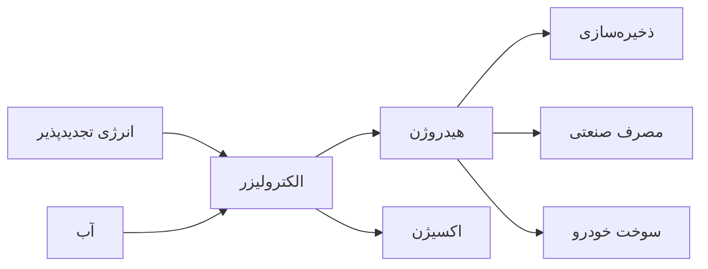

## انقلاب سبز در حال وقوع است

سال ۲۰۲۵ نقطه عطفی در تاریخ انرژی جهان است. برای اولین بار، انرژی‌های تجدیدپذیر بیش از ۵۰٪ تولید برق جهانی را تشکیل می‌دهند.


## فناوری‌های نوین انرژی خورشیدی

### پنل‌های پروسکایت

جدیدترین نسل از سلول‌های خورشیدی با راندمان بالای ۳۰٪ که انقلابی در صنعت ایجاد کرده‌اند.

#### مزایا:
- **راندمان بالا**: تبدیل بیش از ۳۰٪ نور به الکتریسیته
- **هزینه کمتر**: ۵۰٪ ارزان‌تر از پنل‌های سنتی
- **انعطاف‌پذیر**: قابل نصب روی سطوح منحنی
- **سبک**: وزن ۴۰٪ کمتر


### شیشه‌های خورشیدی

پنجره‌هایی که هم نور عبور می‌دهند و هم برق تولید می‌کنند!

```typescript
interface SolarWindow {
  transparency: number; // 60-70%
  efficiency: number; // 10-15%
  powerOutput: number; // watts per square meter
  lifespan: number; // years
}

const modernSolarGlass: SolarWindow = {
  transparency: 65,
  efficiency: 12,
  powerOutput: 150,
  lifespan: 30
};
```

## انرژی بادی: فراتر از تصورات

### توربین‌های فراساحلی غول‌پیکر

جدیدترین توربین‌های بادی با ارتفاع ۲۶۰ متر و قدرت ۱۵ مگاوات.


#### مشخصات فنی:

| ویژگی | مقدار |
|-------|-------|
| قدرت | ۱۵ MW |
| قطر ملخ | ۲۴۰ متر |
| ارتفاع | ۲۶۰ متر |
| تولید سالانه | ۸۰ GWh |
| تأمین برق | ۲۰,۰۰۰ خانوار |

### مزارع بادی شناور

فناوری جدیدی که امکان نصب توربین‌ها در آب‌های عمیق را فراهم می‌کند.


## هیدروژن سبز: سوخت آینده

### الکترولیز پیشرفته

تولید هیدروژن با استفاده از انرژی تجدیدپذیر و راندمان بالای ۸۰٪.

#### فرآیند تولید:




### کاربردهای هیدروژن:

1. **حمل‌ونقل**: کامیون‌ها، اتوبوس‌ها، قطارها
2. **صنعت**: فولادسازی، شیمیایی
3. **گرمایش**: خانگی و تجاری
4. **ذخیره انرژی**: پشتیبان شبکه برق

## ذخیره‌سازی انرژی

### باتری‌های جریان ردوکس

یکی از مؤثرترین روش‌های ذخیره انرژی در مقیاس بزرگ.

**ویژگی‌ها:**
- عمر طولانی (۲۰+ سال)
- ایمنی بالا
- قابلیت مقیاس‌پذیری
- راندمان ۷۵-۸۵٪


### ذخیره با هوای فشرده (CAES)

ذخیره انرژی در غارهای زیرزمینی یا مخازن فشرده.

## تأثیرات اقتصادی

### کاهش هزینه‌ها

قیمت انرژی خورشیدی و بادی در ده سال گذشته:

```javascript
const energyCostReduction = {
  solar: {
    year2015: 0.15, // $/kWh
    year2025: 0.02, // $/kWh
    reduction: 87
  },
  wind: {
    year2015: 0.08,
    year2025: 0.03,
    reduction: 62
  }
};

// محاسبه صرفه‌جویی
function calculateSavings(consumption, technology) {
  const cost2015 = consumption * energyCostReduction[technology].year2015;
  const cost2025 = consumption * energyCostReduction[technology].year2025;
  return cost2015 - cost2025;
}
```


### ایجاد شغل

صنعت انرژی تجدیدپذیر تا ۲۰۲۵:
- ۳۸ میلیون شغل مستقیم
- ۷۵ میلیون شغل غیرمستقیم
- رشد سالانه ۱۵٪

## چالش‌های پیش رو

### ۱. پایداری شبکه

نوسانات تولید انرژی تجدیدپذیر نیازمند سیستم‌های هوشمند مدیریت شبکه است.

### ۲. زیرساخت‌ها

نیاز به سرمایه‌گذاری گسترده در شبکه انتقال و ذخیره‌سازی.

### ۳. مواد خام

تأمین پایدار لیتیوم، کبالت و عناصر کمیاب زمینی.


## راهکارها و نوآوری‌ها

### شبکه‌های هوشمند (Smart Grid)

استفاده از هوش مصنوعی برای بهینه‌سازی توزیع و مصرف انرژی.

### میکروگریدها

شبکه‌های کوچک مستقل که می‌توانند در زمان بحران به صورت جزیره‌ای کار کنند.

### V2G (Vehicle to Grid)

استفاده از خودروهای برقی به عنوان ذخیره‌ساز موقت انرژی.


## آینده‌نگری

### اهداف ۲۰۳۰

- ۸۰٪ برق جهان از منابع تجدیدپذیر
- کاهش ۶۰٪ هزینه ذخیره‌سازی
- ۱۰۰ میلیون خودروی هیدروژنی
- صفر انتشار کربن در تولید برق

### فناوری‌های در دست توسعه

1. **فیوژن هسته‌ای**: انرژی نامحدود و پاک
2. **نانوفناوری خورشیدی**: راندمان بالای ۵۰٪
3. **باتری‌های آلی**: ارزان و سازگار با محیط‌زیست
4. **کاشت‌های انرژی خورشیدی**: استفاده از فتوسنتز مصنوعی


## نتیجه‌گیری

انقلاب انرژی تجدیدپذیر در جریان است و دیگر راهی برای بازگشت نیست. با تکنولوژی‌های نوین، کاهش هزینه‌ها و آگاهی جهانی، ما در آستانه عصر جدیدی از انرژی پاک و پایدار هستیم.

این تحول نه تنها به حفظ محیط‌زیست کمک می‌کند، بلکه فرصت‌های اقتصادی بی‌شماری را نیز به ارمغان می‌آورد.

> "انرژی خورشید که در یک ساعت به زمین می‌رسد، بیش از نیاز انرژی سالانه کل جهان است!"

---

**منابع:**
- آژانس بین‌المللی انرژی (IEA)
- آژانس بین‌المللی انرژی تجدیدپذیر (IRENA)
- مجله Nature Energy
- گزارش انرژی جهانی ۲۰۲۵
